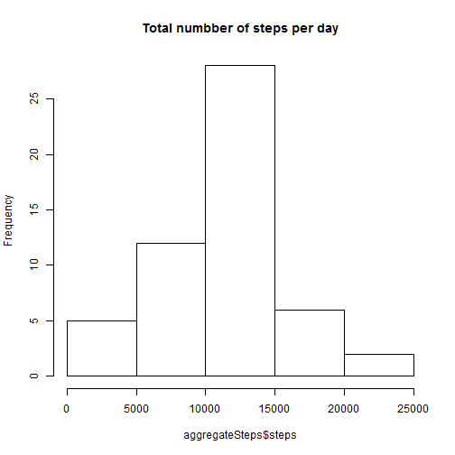
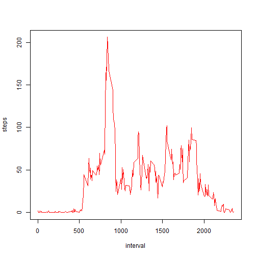
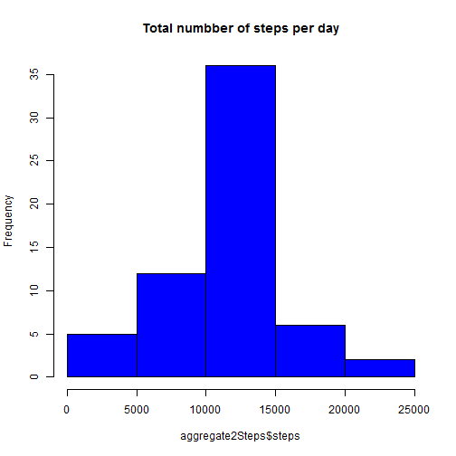
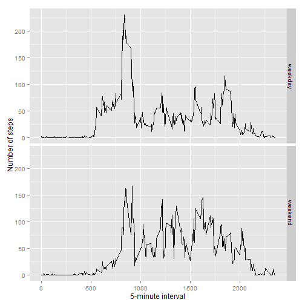

## Reproducible Research assignment

#### Loading and preprocessing the data

1. Load the Data


```r
activity<-read.csv("activity.csv")
```

2. Process/transform the data to suitable format for analysis


```r
cleanData<-activity[!is.na(activity$steps),]
```

####What is mean total number of steps taken per day?
1. Calculate the total number of steps taken per day

```r
aggregateSteps <- aggregate(steps ~ date, data = cleanData, sum)
```
2. Make a histogram of the total number of steps taken each day

```r
hist(aggregateSteps$steps,main = "Total numbber of steps per day")
```

 

3. Calculate and report the mean and median of the total number of steps taken per day

```r
mean(aggregateSteps$steps)
```

```
## [1] 10766.19
```

```r
median(aggregateSteps$steps)
```

```
## [1] 10765
```
####What is the average daily activity pattern?
1. Make a time series plot (i.e. type = "l") of the 5-minute interval (x-axis) and the average number of steps taken, averaged across all days (y-axis)

```r
stepsInterval<-aggregate(steps ~ interval, data = cleanData, mean)
plot(steps ~ interval, stepsInterval, type="l", col="red")
```

 

2. Which 5-minute interval, on average across all the days in the dataset, contains the maximum number of steps?

```r
stepsInterval[which.max(stepsInterval$steps),c("interval")]
```

```
## [1] 835
```
####Imputing missing values
1. Calculate and report the total number of missing values in the dataset (i.e. the total number of rows with NAs)

```r
nrow(activity[which(is.na(activity$steps)),])
```

```
## [1] 2304
```
2. Devise a strategy for filling in all of the missing values in the dataset. The strategy does not need to be sophisticated. For example, you could use the mean/median for that day, or the mean for that 5-minute interval, etc.

```r
intervalForsteps <- function(interval) {
    stepsInterval[stepsInterval$interval == interval, ]$steps
}
```
3. Create a new dataset that is equal to the original dataset but with the missing data filled in.

```r
activityData <- activity
for (i in 1:nrow(activityData)) {
  if (is.na(activityData[i, ]$steps)) {
    activityData[i, ]$steps <- intervalForsteps(activityData[i, ]$interval)
  }
}
```
4. Make a histogram of the total number of steps taken each day and Calculate and report the mean and median total number of steps taken per day.

```r
aggregate2Steps <- aggregate(steps ~ date, data = activityData, sum)
hist(aggregate2Steps$steps,main = "Total numbber of steps per day", col = "blue")
```

 

```r
mean(aggregate2Steps$steps)
```

```
## [1] 10766.19
```

```r
median(aggregate2Steps$steps)
```

```
## [1] 10766.19
```
####Are there differences in activity patterns between weekdays and weekends?
1. Create a new factor variable in the dataset with two levels – “weekday” and “weekend” indicating whether a given date is a weekday or weekend day.

```r
library(timeDate)
activityData$day<-isWeekday(activityData$date, wday = 1:5)
activityData$day[activityData$day==FALSE]<- "weekend"
activityData$day[activityData$day==TRUE]<- "weekday"
table(activityData$day)
```

```
## 
## weekday weekend 
##   12960    4608
```
2. Make a panel plot containing a time series plot (i.e. type = "l") of the 5-minute interval (x-axis) and the average number of steps taken, averaged across all weekday days or weekend days (y-axis).

```r
aggregateDataDay <- aggregate(steps ~ interval + day, data = activityData, mean)
library(ggplot2)
ggplot(aggregateDataDay, aes(interval, steps)) + geom_line() + facet_grid(day ~ .) +xlab("5-minute interval") + ylab("Number of steps") 
```

 


